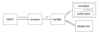

=====
Usage
=====

Overview
--------

The library uses following pipeline of components that handle creatation of notifications.

Signals
-------

Notification creation process starts by sending a Django signal. This mechanism allows hooking notifications to various
events within the system (even inside 3rd party libraries) and helps to decouple the code.

Following types of signals can be used:

* internal Django signals, like ``post_save``
* singals from 3rd party libraries, like ``password_set`` from **django-allauth**
* your own signals

Imagine we would like to create a notification for an author, when someone reads his article. We start by defining
a custom signal::

    from django.dispatch import Signal

    article_viewed = Signal(providing_args=['user', 'article'])

When this signal is sent, it means that ``user`` has viewed ``article``.

Receivers
---------

Receivers receive signals kwargs and pass them to handlers. There are currently two receivers implemented in the
library:

* :class:`~pynotify.receivers.SynchronousReceiver`
* :class:`~pynotify.receivers.AsynchronousReceiver`

By default, the library is using the synchronous receiver, because it is easier for use. The synchronous receiver calls
directly the handler. Asynchronous receiver is more efficient, but requires additional setup, see :ref:`async`.

You can set which receiver will be used in the pipeline by changing ``PYNOTIFY_RECEIVER`` setting (see :ref:`config`).
If you need to implement your own receiver, you should inherit from :class:`~pynotify.receivers.BaseReceiver`.

Most of the time, you don't need to implement your own receivers.

Handlers
--------

Handlers are probably the most important part of the pipeline. They handle creating of
:class:`~pynotify.models.Notification` model instance(s) from signal kwargs received from a receiver.

Handler is typically the only thing you need to define in order to create a new type of notification, provided the
signal you want to react upon already exists.

Let's create a simple handler for our "article viewed" notification::

    from pynotify.handlers import BaseHandler
    from articles.signals import article_viewed

    class ArticleViewedHandler(BaseHandler):

        def get_recipients(self):
            return [self.signal_kwargs['article'].author]

        def get_template_data(self):
            return {
                'title': 'Your article has been viewed!',
            }

        class Meta:
            signal = article_viewed

As you can see, you need to implement at least following methods in the handler:

* :meth:`~pynotify.handlers.BaseHandler.get_recipients`
* :meth:`~pynotify.handlers.BaseHandler.get_template_data`

All handlers are typically kept in file ``handlers.py`` in a dedicated application within the project. When handler is
defined (or more specifically, imported), it is paired with the signal defined in handler's ``Meta``.

Let's say you created ``notifications`` app with ``notifications/handlers.py``. In order for handlers to be
automatically loaded, you must either set the ``PYNOTIFY_AUTOLOAD_MODULES`` in project settings::

    PYNOTIFY_AUTOLOAD_MODULES = ('notifications.handlers',)

or load handlers module manually when Django is ready, i.e. put following code to ``notifications/apps.py``::

    from django.apps import AppConfig

    class NotificationsConfig(AppConfig):

        name = 'notifications'
        verbose_name = 'Notifications'

        def ready(self):
            from . import handlers

Now, when you send the ``article_viewed`` signal, a new notification will be created for article author.

Templates
---------

Templates are blueprints for notifications, they are referenced in the notification and are used to dynamically render
notification fields. Handler's method :meth:`~pynotify.handlers.BaseHandler.get_template_data` returns values for
:class:`~pynotify.models.NotificationTemplate` attributes.

When notification is being created, handler first checks if template with attributes returned by
:meth:`~pynotify.handlers.BaseHandler.get_template_data` exists. If not, the template is first created and then assigned
to the created notification.

The most powerful feature of templates is probably the ability to dynamically render related objects. This can be best
illustrated with an example. We will improve the "article viewed" notification from the previous section::

    from pynotify.handlers import BaseHandler
    from articles.signals import article_viewed

    class ArticleViewedHandler(BaseHandler):

        def get_recipients(self):
            return [self.signal_kwargs['article'].author]

        def get_template_data(self):
            return {
                'title': '<b>{{user}}</b> viewed your article {{article}}',
                'trigger_action': '{{article.get_absolute_url}}'
            }

        def get_related_objects(self):
            return {
                'user': self.signal_kwargs['user'],
                'article': self.signal_kwargs['article']
            }

        class Meta:
            signal = article_viewed

As you can see, we have changed the template strings to true Django templates, because the template fields, when
accessed through :class:`~pynotify.models.Notification`, are rendered using Django template engine with context filled
with named related objects. This is very convenient since notifications will always stay up to date, even if related
object changes.

.. note::
   For security reasons, you can only access related object's string representation and a set of attributes defined in
   ``PYNOTIFY_RELATED_OBJECTS_ALLOWED_ATTRIBUTES``. See :ref:`config` for more information.

.. caution::
   Avoid adding unnecessary attributes to ``PYNOTIFY_RELATED_OBJECTS_ALLOWED_ATTRIBUTES``, since it increases
   coupling between notification template(s) and the code. This is undesirable and makes managing and maintenance of
   notifications harder.

   Always consider first to store attribute's value in extra data (as described lower), or save nested objects as
   standalone related objects (if you really need dynamic behavior).

In case you want to "freeze" the values used in template strings (i.e. not reflect changes made in related objects),
define :meth:`~pynotify.models.Notification.get_extra_data`, which should return a dict of JSON serizalizable values.
These extra data are also put into template context, together with named related objects.

Instead of using :meth:`~pynotify.handlers.BaseHandler.get_template_data`, you can define handler's attribute
``template_slug``. This is a better option in case you prefer to often change template strings via administration
interface.  Note, that the admin template (:class:`~pynotify.models.AdminNotificationTemplate`) referenced by slug
must already exist - it won't be automatically created. You can create it in administration interface or using data
migration.

Given the admin template with slug `article-viewed`, our handler can be modified as follows::

    from pynotify.handlers import BaseHandler
    from articles.signals import article_viewed

    class ArticleViewedHandler(BaseHandler):

        template_slug = 'article-viewed'

        def get_recipients(self):
            return [self.signal_kwargs['article'].author]

        def get_related_objects(self):
            return {
                'user': self.signal_kwargs['user'],
                'article': self.signal_kwargs['article']
            }

        class Meta:
            signal = article_viewed

Dispatchers
-----------

Dispatchers are used by handlers to propagate notifications through various communication channels, e.g. SMS, e-mails,
push. The library currently does not include any specific dispatchers, just the base class
:class:`~pynotify.dispatchers.BaseDispatcher`.

Let's implement e-mail notifications for our "article viewed" notification. We'll start by creating an e-mail
dispatcher::

    from pynotify.dispatchers import BaseDispatcher
    from django.core.mail import send_mail

    class EmailDispatcher(BaseDispatcher):

        def dispatch(notification):
            send_mail(
                subject=notification.title,
                message=notification.text,
                from_email='noreply@example.com',
                recipient_list=(notification.recipient.email,),
            )

And now we will add our dispatcher to the handler::

    from pynotify.handlers import BaseHandler
    from articles.signals import article_viewed

    from .dispatcher import EmailDispatcher

    class ArticleViewedHandler(BaseHandler):

        dispatchers = (EmailDispatcher,)

        ...
        ...
